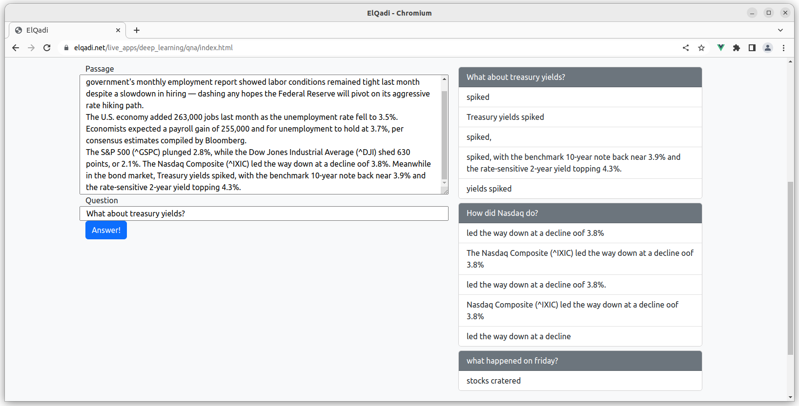

# bert_qna_js
A natural language processing (NLP) project to answer comprehension questions on a passage. The project is built on TesnorFlow for javascript (TFJS) and VueJS, the TF model is BERT pretrained on SQUAD 2.0 dataset.

The application live demo is available at https://elqadi.net/live_apps/deep_learning/qna/index.html
